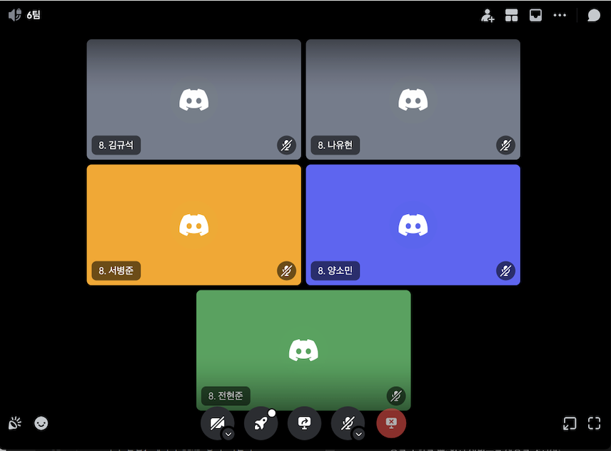

## 팀 구성원, 개인 별 역할

- 김규석(팀장) - 팀 내부 회의 주관, 아이디어톤 발표, 공지사항 기능 개발
- 서병준 - 사용자 인증 및 소셜 로그인 기능 개발
- 양소민 - 위클리 작성, Q&A 게시판 기능 개발
- 나유현 - 도서 상세 페이지, 도서 예약 기능 개발
- 전현준 - 메인페이지(도서 목록 조회, 추천 도서 기능) 개발

## 팀 내부 회의 진행 회차 및 일자

- 1회차(2024.03.18) 디스코드 음성채팅
- 2회차(2024.03.19) 디스코드 음성채팅
- 3회차(2024.03.20) 디스코드 음성채팅
- 4회차(2024.03.21) 디스코드 음성채팅
- 5회차(2024.03.22) 디스코드 음성채팅(서병준 결석)

## 현재까지 개발 과정 요약 (최소 500자 이상)

- 아이디어톤 발표 진행.
- 기능별 목표: 사용자 인증 및 소셜 로그인 / 목표 달성률 60% - API 요청시 브라우저에 저장된 Token을 회수해서 서버로 보내주는 스크립트 구현중 / 로그인 페이지 버튼으로 만들기 작업 필요
- 기능별 목표: 도서 상세페이지 - 도서 상세 페이지, 도서 예약 기능 / 목표달성률: 40% - 구현단계 / 백엔드 완성, 프론트 작업 필요.
- 기능별 목표: 메인페이지 - 도서 목록 조회, 추천 도서 기능 / 목표달성률: 60% - 구현 단계 /  프론트템플릿 거의 종료, 백엔드 추가하면서 필요부분만 수정하면됨. 도서 상세 ERD구현여부 확인 후 추천도서 백엔드 작업필요, 추가 페이지들 추후 링크작업필요, 검색기능 백엔드작업 필요.
- 기능별 목표: 공지사항 게시판 / 목표달성률 60% - 템플릿 수정중 (90%이상 완성) / 공지사항 페이지, 공지사항 작성 및 수정, 삭제 기능 구현 중 
- 기능별 목표: Q&A 게시판 / 목표달성률: 80% - 템플릿 적용 단계 / 질문 목록 조회, 상세 조회, 답변 등록 기능 등 개발 완료. 글 등록시 로그인한 사용자의 id가 등록되도록 하는 기능 구현 필요.(사용자 로그인 기능 개발 후 구현 가능), 템플릿 수정 필요.

## 개발 과정에서 나왔던 질문 (최소 200자 이상)

- 현재 위치에서 대여하려는 도서가 있는 가까운 도서관들을 지도상에 나타내려고 합니다. 처음에는 redis geospatial 자료구조를 이용해서 기능을 구현하려고 했습니다. 근데 이제 생각을 해보니깐 누군가 도서를 대여했다면 redis에서 해당 도서관 정보를 삭제해줘야하는 과정이 필요하더라구요. 저는 redis를 이용한 구현밖에 생각나지 않는데 혹시 다른 방법이 없는지 궁금합니다.
- 도서 대출하는 과정에서 레이스컨디션 문제가 있을 것 같아서 락을 사용하려고 합니다. 아무래도 책을 동시에 대여하려는 경우는 적을 것 같아서 비관적 락보다 낙관적 락을 사용하는게 낫다는 생각이 들었습니다. 개발할 때 어떤 락을 사용할 지는 직접 성능 테스트를 해보고 결정하는지 아니면  특정 경우에 사용하는 락이 정해져 있는지 궁금합니다.
- API 요청을 보낼때, 브라우저에 저장된 Token 정보를 회수해서 함께 보내는데, 계속 url을 통해서 전달하는 건가요?
## 개발 결과물 공유

Github Repository URL: https://github.com/min2023237/team_6.git

